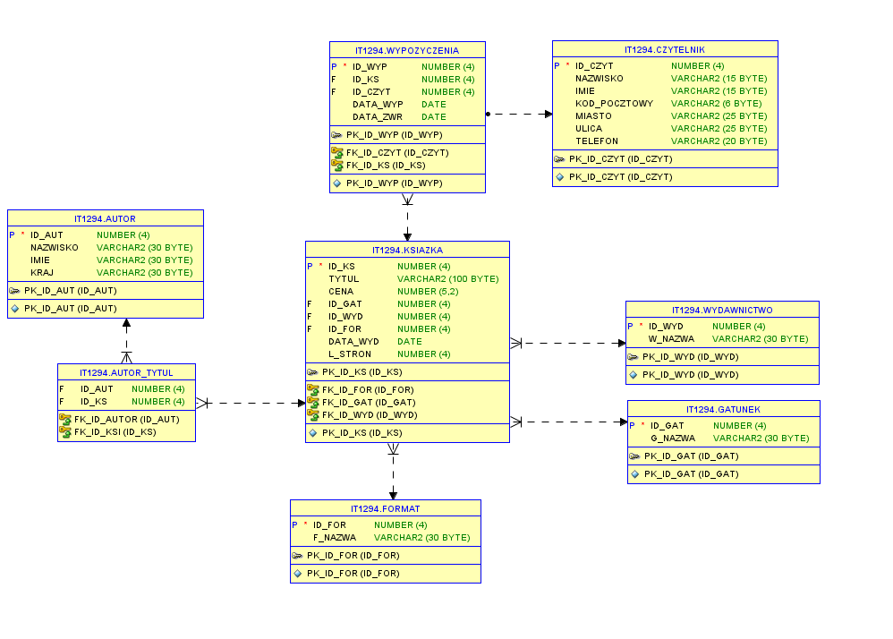

# PL/SQL trainning

In this repo was created for PL/SQL review of what I have learned during my course. Starting with basics od SQL and moving on to concepts of PL/SQL such as varriables, loops, if statement, SELECT INTO, CURSOR, EXCEPTION, SEQUENCES, TRIGGERS, PROCEDURE, FUNCTION, PACKAGE 
In my training I used Oracle SQLdeveloper.


## Used data

Short description: my database contain data that could be collected while working in library. You can search for details about specific book, it's autor, publishing house, history of borrowing book or readers.

### ERD diagram


## SQL basics

### Creating table

First of all we have to create some tables to work on. For that we use
```sql
CREATE TABLE Name (
    field_name TYPE CONSTRAINT,
);
```
Example of creating new table
```sql
CREATE TABLE Books (
    book_id INT PRIMARY KEY, -- Primary Key constraint
    title VARCHAR(100) NOT NULL, -- NOT NULL constraint
    author VARCHAR(100) NOT NULL,
    genre VARCHAR(50) NOT NULL,
    publication_year INT,
    isbn VARCHAR(13) UNIQUE, -- UNIQUE constraint
    FOREIGN KEY (author) REFERENCES Authors(author_name) -- FOREIGN KEY constraint
    ON DELETE CASCADE, -- Specifies what to do when a referenced row in the parent table is deleted
    price DECIMAL(10, 2) DEFAULT 0, -- DEFAULT constraint
    CHECK (price >= 0) -- CHECK constraint
);

-- Creating an index on the title column for faster data retrieval
CREATE INDEX idx_title ON Books(title);
```

### Inserting data

For data we want to insert into our table we can use:
```sql
INSERT INTO name VALUES(a,b,..);
```

### Naming columns
- aliases and space between words
```sql
SELECT imie || ' ' || nazwisko AS "dane klienta" FROM klienci;
```

### Filtering operators
- ALL
- BETWEEN
- EXISTS
- **LIKE**
- NULL

Retrieve all books with a number of pages greater than every other book's page count
```sql
SELECT * FROM books
WHERE pages > ALL (SELECT pages FROM books)
AND release_date BETWEEN '2020-01-01' AND '2022-12-31'
AND author_id IS NOT NULL;
```

Retrieve all customers who have made a purchase in the past and whose name starts with 'J'
```sql
SELECT * FROM customers
WHERE EXISTS (SELECT * FROM purchases WHERE purchases.customer_id = customers.customer_id)
AND customer_name LIKE 'J%'
AND NOT customer_name LIKE '%Test%';
```

### Group by

**You always have to connect group by with some aggregate functions**

GROUP BY -> COUNT(), SUM(), AVG()

```sql
SELECT nazwa,COUNT(id_rozprawa) FROM pracownicy
JOIN rozprawa ON pracownicy.id_prac = rozprawa.id_prac
JOIN specjalnosc ON pracownicy.id_spec = specjalnosc.id_spec
GROUP BY nazwa
```

### Where

**You always use it before GROUP BY**

### Having

**You always use it after GROUP BY or aggregation functions**
